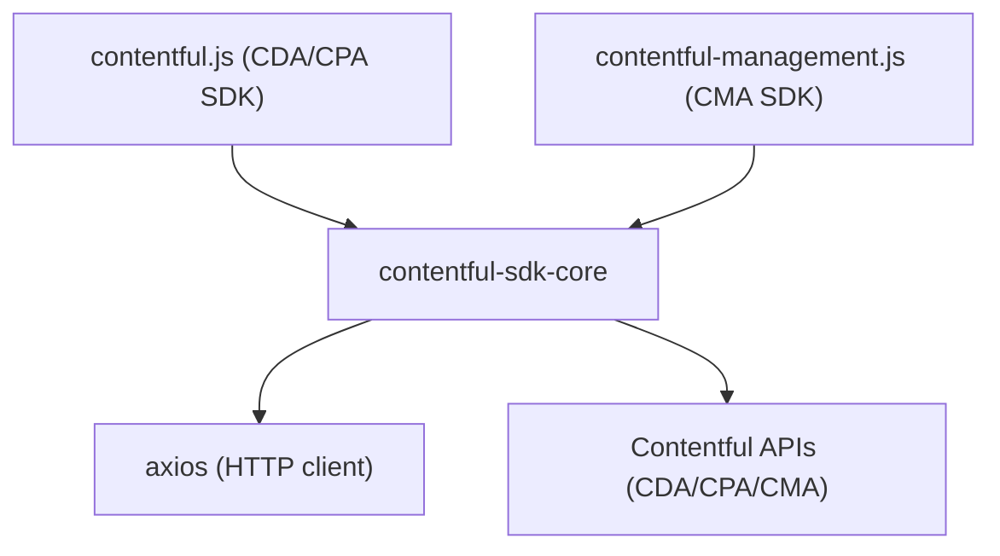

<!-- Generated by seed-golden-context | Last updated: 2026-05-06 -->

# Architecture

## Overview

`contentful-sdk-core` is a shared utility library that provides the HTTP client foundation, rate limiting, error handling, and common helpers used by both `contentful.js` (CDA/CPA) and `contentful-management.js` (CMA). It is not used directly by end users — it is an internal dependency of the public-facing Contentful JavaScript SDKs.

## System Context

## Internal Structure

| Module | Purpose |
|---|---|
| `src/create-http-client.ts` | Factory that creates a pre-configured axios instance with interceptors for auth, throttling, and retry |
| `src/create-default-options.ts` | Builds axios config from SDK initialization params (baseURL, auth, timeouts, agents) |
| `src/rate-limit.ts` | Response interceptor implementing exponential backoff retry on 429/5xx/network errors |
| `src/rate-limit-throttle.ts` | Request interceptor implementing proactive request throttling (auto-adapts to `x-contentful-ratelimit-second-limit` header) |
| `src/pThrottle.ts` | Internal promise-based throttle implementation (internalized from `p-throttle` package) |
| `src/async-token.ts` | Request interceptor that resolves async access token functions before each request |
| `src/error-handler.ts` | Transforms axios error responses into structured Contentful error objects with redacted auth headers |
| `src/create-request-config.ts` | Normalizes request parameters (query string serialization via `qs`) |
| `src/get-user-agent.ts` | Builds the SDK user-agent string for API analytics |
| `src/freeze-sys.ts` | Deep-freezes `sys` metadata objects to prevent accidental mutation |
| `src/to-plain-object.ts` | Converts response entities to plain objects with a `toPlainObject()` method |
| `src/enforce-obj-path.ts` | Validates required nested object paths exist |
| `src/types.ts` | TypeScript type definitions for `CreateHttpClientParams`, `AxiosInstance`, `DefaultOptions` |
| `src/utils.ts` | Shared utility functions (e.g., `noop`) |

## Data Flow

1. Downstream SDK calls `createHttpClient(axios, params)` during client initialization
2. `createDefaultOptions` builds the axios config: baseURL from host/space/protocol, auth headers, timeouts, params serializer
3. Interceptors are attached in order:
   - `onBeforeRequest` (optional custom interceptor)
   - `asyncToken` (if accessToken is a function — resolves before each request)
   - `rateLimitThrottle` (proactive: limits requests/second to stay under rate limit)
   - `rateLimitRetry` (reactive: retries on 429, 5xx, and network errors with exponential backoff)
   - `onError` (optional custom error handler)
4. The configured axios instance is returned; all subsequent API calls go through these interceptors

### Failure Behavior

When the Contentful API (or network) is unavailable:

1. The `rateLimitRetry` interceptor catches 429, 5xx, or network errors
2. It retries with exponential backoff (√2^attempts seconds + jitter), up to `retryLimit` (default 5)
3. For 429 responses, it respects the `x-contentful-ratelimit-reset` header as the wait duration
4. If all retries exhaust, the error is rejected as a standard promise rejection back to the calling SDK
5. The downstream SDK surfaces this to the consumer as a thrown error

There is no circuit breaker or graceful degradation — this library propagates failures after retry exhaustion. Consumers are responsible for their own error handling and fallback logic.

## Key Dependencies

| Dependency | Why it's here |
|---|---|
| `axios` | HTTP client (provided by downstream SDKs as a peer-style dependency via the factory pattern) |
| `qs` | Query string serialization that handles nested objects and arrays correctly for the Contentful API |
| `lodash` | `isPlainObject` and `isString` utilities for type checking in error handler and throttle logic |
| `fast-copy` | Deep-clones HTTP client params without breaking non-serializable fields (httpAgent/httpsAgent) |
| `process` | Browser polyfill for `process.env.NODE_ENV` checks in the bundle |

## Configuration

| Parameter | Purpose | Default |
|---|---|---|
| `accessToken` | API auth token or async function returning one | (required) |
| `space` | Space ID, appended to baseURL | `undefined` |
| `host` | API hostname override | SDK-specific default |
| `retryOnError` | Enable retry on 429/5xx/network errors | `true` |
| `retryLimit` | Max retry attempts before failing | `5` |
| `timeout` | Request timeout in milliseconds | `30000` |
| `throttle` | Rate limit strategy: `'auto'`, `'N%'`, or fixed number | `0` (disabled) |
| `insecure` | Use HTTP instead of HTTPS | `false` |
| `maxContentLength` | Max response body size | `1073741824` (1 GB) |
| `maxBodyLength` | Max request body size | `1073741824` (1 GB) |

## Operational Knowledge

This is a publish-and-forget npm library. There is no running service, no monitoring, and no incident playbook.

- **Release**: Fully automated via `semantic-release` on merge to `master`. Pre-release channels exist for `beta` and `dev` branches.
- **Downstream coordination**: `contentful-management.js` pins `^9.x.x` (caret range) and picks up minor/patch releases automatically. Major (breaking) releases require manual downstream SDK updates.
